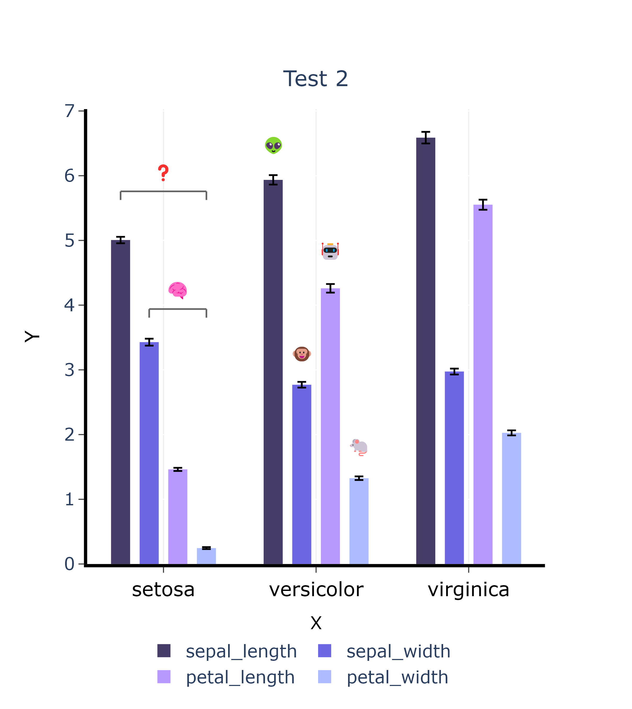
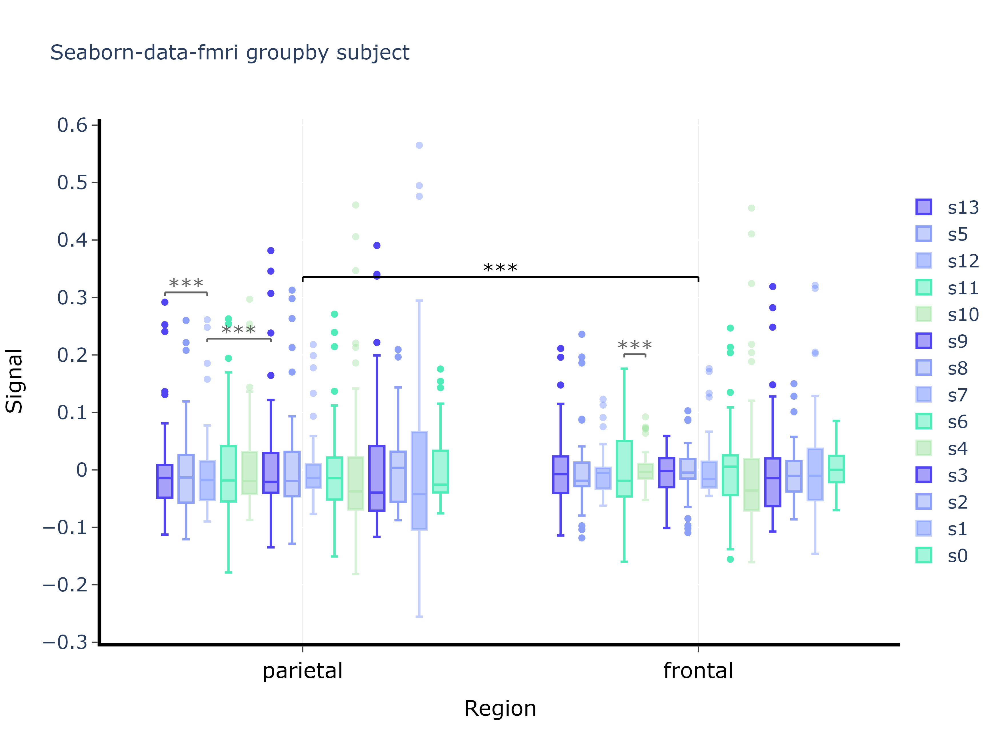

# plotly-signif
 A python example of drawing a box plot based on the plotly package, with freely definable statistical annotations


## How to use

- Download the `plotly_signif.py` to the path of your program
- ```py
  from plotly_signif import *
  ```
- Enjoy it

### Bar 

You can refer to the following example : 

```py
from plotly_signif import *
import pandas as pd
iris = pd.read_csv('https://raw.githubusercontent.com/mwaskom/seaborn-data/master/iris.csv')
df1 = iris.groupby("species").mean()
df2 = iris.groupby("species").sem()
```

```py
test = plotly_signif(data=df1,error=df2,text={"x":"X","y":"Y"})  
test.plot()
# 添加统计注释
annotation_list = [[0,1,1],[2,0,3,-1],[2,1,2,2],[0,1,3,6],[0,2,3,9]]
test.add_annotations(annotation_list = annotation_list,text="***",inne_color="#B799FF")   
test.add_annotations(annotation_list = [[1,2,3,3]],text="🏅",sign_d_index=2) 
test.add_annotations(annotation_list = [[1,1,2,4]],text="😭",sign_d_index=2) 
test.add_annotations(annotation_list = [[1,0,2,2]],text="⭐⭐⭐",sign_d_index=2,size=12) 
test.add_annotations(annotation_list = [[1,2,0]],text="ns",size=14,sign_d_index=2.5) 
# 绘制/保存
test.show("./image/example.png")  # 保存使用属性 save_path = "./image/example.png" 
```


```py
test2 = plotly_signif(data=df1,error=df2,text={"x":"X","y":"Y"})  
test2.set_color(["#453C67","#6D67E4",'#B799FF','#ACBCFF']) # change the colors
test2.plot(pic_px=[580,650])
# An example of changing labels based on plotly syntax
test2.fig.update_layout(
    title = dict(  # set the title
        text = "Test 2",
        font = {'size': 20},
        x = 0.5,
        y = 0.9,
        ),
)
test2.fig.update_layout(   # set the side labels
                legend=dict(
                    orientation="h",
                    x=0.12,
                    y=-0.15, 
                    traceorder="normal",
                    font=dict(size=16),
                ),
            )
test2.add_annotations(annotation_list = [[0,1,3,6]],text="🧠",sign_d_index=2) 
test2.add_annotations(annotation_list = [[0,0,3,3]],text="❓",sign_d_index=2) 
test2.add_annotations(annotation_list = [[1,0,0,2.3]],text="👽",sign_d_index=2,inne_color="#FFFFFF") 
test2.add_annotations(annotation_list = [[1,2,2,5]],text="🤖",sign_d_index=2,inne_color="#FFFFFF") 
test2.add_annotations(annotation_list = [[1,1,1,7.6]],text="🐵",sign_d_index=2,inne_color="#FFFFFF") 
test2.add_annotations(annotation_list = [[1,3,3,10]],text="🐁",sign_d_index=2,inne_color="#FFFFFF") 
test2.show()
```



### Box


```py
data = pd.read_csv('https://raw.githubusercontent.com/mwaskom/seaborn-data/master/fmri.csv')


subject	timepoint	event	region	signal
0	s13	18	stim	parietal	-0.017552
1	s5	14	stim	parietal	-0.080883
2	s12	18	stim	parietal	-0.081033
3	s11	18	stim	parietal	-0.046134
4	s10	18	stim	parietal	-0.037970
...	...	...	...	...	...
1059	s0	8	cue	frontal	0.018165
1060	s13	7	cue	frontal	-0.029130
1061	s12	7	cue	frontal	-0.004939
1062	s11	7	cue	frontal	-0.025367
1063	s0	0	cue	parietal	-0.006899
```

```py
Box_test = plotly_signif(data=data,text={"x":"Region","y":"Signal"},mode="Box")  
Box_test.plot(pic_px=[840,620],Box_list=["subject","region","signal"])
annotation_list = [[0,1,0],[0,0,2,1],[0,2,5,4],[1,3,4,5]]
Box_test.add_annotations(annotation_list=annotation_list)
Box_test.fig.update_layout(title_text="Seaborn-data-fmri groupby subject")
Box_test.show()
```



## Parameter explanation

🌀 You can use plotly's syntax to set the `object.fig` , new settings will overwrite the default settings.

- `__init__` : 
  - **data :** Data frame used for drawing bar chart
  - **error :** Data frame corresponding to error bars, only used with `mode = "Bar"`
  - **text :** Image text label
  - **mode :** _default = "Bar"_ , and supports "Box" to plot
- `plot()`
  - **pic_px :** image size list , [width,height] , The unit is px
  - **Box_list :** If a box plot is drawn, the meaning of this list is `["which Group","which x","which y"] `
- `add_annotations()`
  - **annotation_list :** A two-dimensional list representing the position of the annotation, with each sublist representing an annotation. The length of 3 is the inter-group annotation, the length of 4 is the intra-group annotation, and the last value controls the y-axis position.

    `[0,1,1]` means that the annotation is between the 1/2th group, and the y-axis position drops 1 level relative to y_max; `[2,0,3,-1]` means that the annotation is within the 3rd group, and within the group In the 1/4th column, the y-axis position rises one level relative to y_max.
    > 表示注释在什么位置的二维列表，每一个子列表表示一个注释。长度为3的是组间注释，长度4为组内注释，最后一个值控制y轴位置。
    >
    > `[0,1,1]` 表示注释在第1/2个组之间，y轴位置相对于 y_max 下降1层；`[2,0,3,-1]` 表示注释在第3个组内，组内的第1/4个柱间，y轴位置相对于 y_max 上升一层。
  - **text :** annotation symbol, _default = "***"_ , which can also be 🪙🆙🏅⭐🔥🍋💔😃😭 ... symbols, visible https://www.emojiall.com/zh-hans/copy 
  - **size :**  symbol font size, _default = 16_
  - **line_width :** line width, _default = 1.5_
  - **color :** intergroup annotation color, _default = 'rgba(0,0,0,1)'_
  - **inne_color :**  annotation color within group, _default = "rgba(100,100,100,1)"_
  - **y_max_index :** The y-height of the annotation when layer is set to 0, _default = 1.15_ , multiply the height of the tallest bar in the chart by y_max_index to get y_max
  - **layer_down_index :** control the spacing between upper and lower layers, _default = 0.08_ , layer_down = layer_down_index $ \times $ y_max
  - **sign_d_index :** distance between line and symbol, _default = 4_ , layer_down / sign_d_index
  - **line_d_index :** the length of the hanging line, _default = 3.2_ , layer_down / line_d_index
- `show()`
  - **save_path :** path to save.
- `set_color()` : set the color of the column, given a list
  `set_color()` need before use `plot()`


## TODO

- [x] Supports boxplots
- [ ] Supports horizontal drawing

## Any feedback on bugs or suggestions for features are welcome