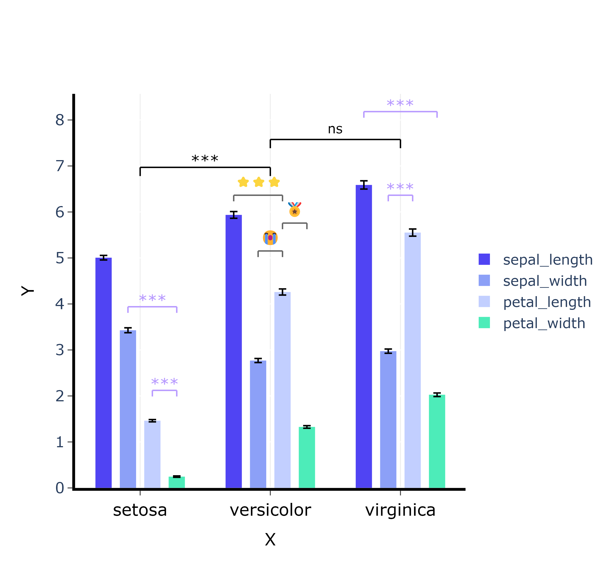

# plotly-signif
 A python example of drawing a box plot based on the plotly package, with freely definable statistical annotations


## How to use

```py
from plotly_signif import *
import pandas as pd
iris = pd.read_csv('https://raw.githubusercontent.com/mwaskom/seaborn-data/master/iris.csv')
df1 = iris.groupby("species").mean()
df2 = iris.groupby("species").sem()
```

```py
test = plotly_signif(data=df1,error=df2,text={"x":"","y":""})  
test.plot()
# Add statistical annotation
annotation_list = [[0,1,1],[2,0,3,-1],[2,1,2,2],[0,1,3,6],[0,2,3,10]]
test.add_annotations(annotation_list = annotation_list,text="***")   
test.add_annotations(annotation_list = [[1,2,3,4]],text="🏅",sign_d_index=2) 
test.add_annotations(annotation_list = [[1,1,2,5]],text="😭",sign_d_index=2) 
test.add_annotations(annotation_list = [[1,0,2,2]],text="⭐⭐⭐",sign_d_index=2,size=12) 
test.add_annotations(annotation_list = [[1,2,0]],text="ns",size=14,sign_d_index=2) 
# draw/save
test.show(save_path="./image/example.png")  # Save usage properties save_path = "./image/example.png" 
```




## Parameter explanation

- `__init__` : 
  - **data :** Data frame used for drawing bar chart
  - **error :** Data frame corresponding to error bars
  - **text :** Image text label
- `plot()`
  - **pic_px :** image size list , [width,height] , The unit is px
- `add_annotations()`
  - **annotation_list :** 
  - **text :** annotation symbol, _default = "***"_ , which can also be 🪙🆙🏅⭐🔥🍋💔😃😭 ... symbols, visible https://www.emojiall.com/zh-hans/copy 
  - **size :**  symbol font size, _default = 16_
  - **line_width :** line width, _default = 1.5_
  - **color :** intergroup annotation color, _default = 'rgba(0,0,0,1)'_
  - **inne_color :**  annotation color within group, _default = "rgba(100,100,100,1)"_
  - **y_max_index :** The y-height of the annotation when layer is set to 0, _default = 1.15_ , multiply the height of the tallest bar in the chart by y_max_index to get y_max
  - **layer_down_index :** control the spacing between upper and lower layers, _default = 0.08_ , layer_down = layer_down_index $ \times $ y_max
  - **sign_d_index :** distance between line and symbol, _default = 4_ , layer_down / sign_d_index
  - **line_d_index :** the length of the hanging line, _default = 3.2_ , layer_down / line_d_index
- `show()`
  - **save_path :** path to save.
- `set_color()` : set the color of the column, given a list